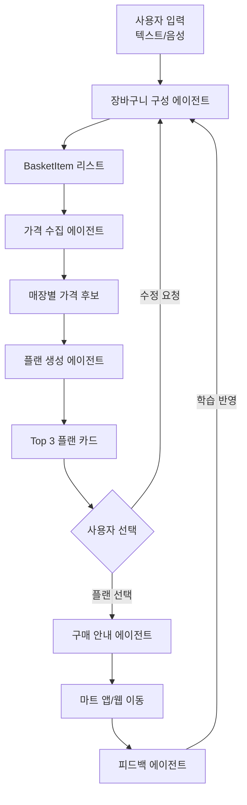

# 똑장 에이전트 정의 (Agents)

> **큰 작업을 시작하기 전에 반드시 `reference/` 디렉토리를 참고하세요.**
> - `reference/ARCHITECTURE.md` — 디렉토리 구조 및 설계 원칙
> - `reference/stack.md` — 기술 스택
> - `PRD.md` — 서비스 상세 기획서

---

## 1. 에이전트 시스템 개요

똑장은 **LLM 기반 장보기 에이전트**로, 사용자의 장보기 전 과정을 구조화하고 의사결정을 보조한다.

```
사용자 입력(텍스트/음성)
  → 장바구니 구성 에이전트
  → 가격 수집 에이전트
  → 플랜 생성 에이전트
  → 결과 출력 및 구매 안내
```

---

## 2. 에이전트 역할 정의

### 2-1. 장바구니 구성 에이전트 (Basket Agent)

**역할**: 사용자 입력을 `BasketItem` 리스트로 구조화

**입력**
- 텍스트 또는 음성(STT 변환 후) 자연어 입력
- 예: "계란 30구, 풀무원 두부 2개, 오뚜기 진라면 5봉"

**처리 흐름**
1. 자연어 파싱 → 품목/수량/브랜드/용량 추출
2. 누락 정보 질문 (브랜드/용량 고정 여부)
   - "브랜드 고정할까요?" → 고정모드(🔒) 또는 추천모드(⭐)
   - "용량/규격 고정할까요?" → 필터 또는 가성비 추천
3. 장바구니 변경안(diff) 카드 생성
4. 사용자 확인 후 적용: `[모두 추가]` / `[항목 수정]` / `[취소]`

**출력**
```json
{
  "items": [
    {
      "item_name": "계란",
      "brand": null,
      "size": "30구",
      "quantity": 1,
      "category": "축산/계란",
      "mode": "recommend"
    }
  ]
}
```

**행동 규칙**
- 바로 추가하지 말고, 반드시 변경안(diff)을 먼저 보여줄 것
- 고정모드 상품의 브랜드를 자동 변경하지 말 것
- 요리 맥락을 이해하고 필요한 재료를 제안할 수 있음
  - 예: "김치찌개 만들고 싶은데 두부랑 고기는 있어" → 나머지 재료 자동 제안

---

### 2-2. 가격 수집 에이전트 (Price Collector Agent)

**역할**: 장바구니 품목에 대해 온라인/오프라인 가격 후보 수집

**온라인 수집**
- 네이버 쇼핑 검색 API 호출 (`sort=asc` 가격 오름차순)
- 품목별 상위 N개 결과 수집
- 결과: `lprice`, `mallName`, `productId`, `link`

**오프라인 수집**
- (MVP) 참가격/공공데이터 기반 Mock 데이터
- (확장) 제휴 데이터 연동 (Provider 교체)
- 매장 후보: 카카오 Local API → 키워드/카테고리 검색

**가격 매칭 흐름**
1. 사용자 위치(좌표) 확보
2. 주변 매장 후보 검색 (장소 API)
3. 후보 매장별 이동시간/거리 계산 (길찾기 API)
4. 장바구니 품목 가격 매칭 (매장-상품 테이블)
5. 총액 계산

**행동 규칙**
- 스크래핑 금지 — 공식 API만 사용
- 모든 가격에 출처/갱신일 메타데이터 부착
- API 쿼터에 대비한 캐시 전략 적용
- 브랜드 고정모드(🔒) 품목은 해당 브랜드+규격으로만 검색

---

### 2-3. 플랜 생성 에이전트 (Plan Generator Agent)

**역할**: 수집된 후보를 기반으로 Top 3 추천 플랜 생성

**플랜 유형**
| 플랜 | 기준 | 설명 |
|------|------|------|
| A (최저가) | 총액 최소 | 가격이 가장 낮은 조합 |
| B (가까움) | 이동시간 최소 | 가장 빠르게 갈 수 있는 매장 |
| C (균형) | 가격 + 이동 가중 | 가격과 이동의 균형 |

**플랜 카드 정보**
- 매장/몰 이름
- 추정 총액 (원)
- 품목 커버리지 (예: 11/12개)
- (오프라인) 이동시간/거리 + 날씨 주의
- (온라인) 배송 정보 + 구매 링크
- 가격 출처/갱신일/신뢰도

**정렬 기준**
1. 총액(total_cost) 오름차순
2. 커버리지(coverage) 내림차순
3. 이동시간 오름차순

**행동 규칙**
- 추천 이유를 반드시 근거(숫자)와 함께 설명
- "가격만 싼 추천"이 아닌 "실제 행동 가능한 추천" 제공
- 사용자 선호 브랜드/쇼핑몰을 우선 반영
- 비선호 브랜드/몰은 Top3에서 제외, 하단에 "더 저렴한 대안"으로 별도 표시

---

### 2-4. 구매 안내 에이전트 (Checkout Guide Agent)

**역할**: 사용자가 플랜을 선택한 후 구매 진행 안내

**동작 흐름**
1. 상품 링크(유니버설 링크)로 마트 앱/웹 열기
2. 담기 도우미 모드: 순차 담기 (`1/5 상품 담기`) 안내
3. 완료 안내: "모든 상품을 담았습니다. 장바구니에서 결제를 진행해 주세요."

**행동 규칙**
- ❌ 자동 로그인 / 자동 장바구니 조작 / 자동 결제 절대 금지
- ✅ 링크 기반 안내만 수행
- ✅ 사용자 명시적 행동만 트리거
- 로그인/결제는 마트 앱 상태를 따름 (우리 앱에서 개입 ❌)

---

### 2-5. 피드백 에이전트 (Feedback Agent)

**역할**: 사용자 행동 로그 수집 및 학습 기반 개선

**수집 대상 (MVP)**
- 선택된 플랜
- 품목 변경 이벤트
- 실행 시간 / 에러 로그

**향후 확장**
- 구매 주기 학습 → 재구매 제안
  - 예: "보통 닭가슴살을 2주에 한 번 구매하시는데, 이번 주가 다시 구매할 시점이에요."
- 반복 거절 시 추천 빈도 자동 감소

**행동 규칙**
- 개인정보 최소 원칙: 사용자 식별 정보 과도 수집 금지
- 원본 음성 저장 금지 (opt-in 없이)

---

## 3. 에이전트 간 데이터 흐름



---

## 4. LangGraph 노드 매핑

| 에이전트 | LangGraph 노드 | 위치 |
|----------|----------------|------|
| 장바구니 구성 | `parse`, `clarify` | `backend/app/infrastructure/graph/nodes/` |
| 가격 수집 | `search_online`, `search_offline` | `backend/app/infrastructure/providers/` |
| 플랜 생성 | `rank`, `generate_plan` | `backend/app/application/usecases/` |
| 구매 안내 | `checkout_guide` | `backend/app/api/v1/routers/` |
| 피드백 | `log_feedback` | `backend/app/infrastructure/persistence/` |

---

## 5. 에이전트 대화 예시

### 예시 1: 기본 장바구니 구성
```
👤 "계란 30구랑 우유 1L 추가해줘"
🤖 "계란은 브랜드를 고정할까요, 아니면 가성비로 추천할까요?"
👤 "추천해줘"
🤖 "장바구니에 추가할게요:
    + 계란 30구 (추천모드 ⭐)
    + 서울우유 1L (고정모드 🔒 - 자주 구매하시는 브랜드)
    
    [모두 추가] [항목 수정] [취소]"
```

### 예시 2: 요리 기반 자동 구성
```
👤 "김치찌개를 만들고 싶은데 두부랑 고기는 있어"
🤖 "김치찌개 재료를 추가할게요. (이미 있는 재료는 제외했어요)
    + 김치 1kg
    + 양파 1kg
    + 대파 1단
    + 마늘 500g
    + 고춧가루 200g
    
    예상 추가 금액: ₩12,800
    
    [모두 추가] [항목 수정] [취소]"
```

### 예시 3: 재구매 제안 (향후)
```
🤖 "보통 닭가슴살을 2주에 한 번 구매하시는데,
    이번 주가 다시 구매할 시점이에요. 추가할까요?"
    
    [추가] [이번엔 패스]
```
