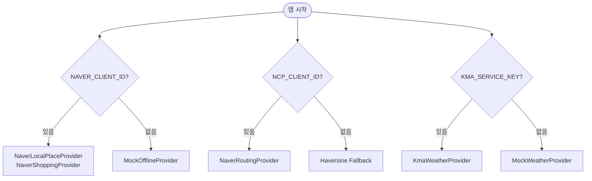

# 똑장 Architecture

> **버전**: v1.0 | **작성일**: 2026-02-18

---

## 1. 시스템 전체 구조


---

## 2. 레이어별 역할

| 레이어 | 구성 | 역할 |
|---|---|---|
| **API** | FastAPI Router | 요청 수신, 인증, 에러 포맷 |
| **Application** | ChatService, PlanService, MallComparer | 비즈니스 로직 |
| **Domain** | BasketItem, Plan, ShoppingContext | 핵심 도메인 모델 |
| **Infrastructure** | Provider, CacheService, Repository | 외부 연동 격리 |
| **LangGraph** | ChatState, parse/clarify 노드 | 대화 흐름 제어 |

---

## 3. 플랜 생성 데이터 흐름


---

## 4. AI 챗 데이터 흐름


---

## 5. LangGraph 에이전트 상세


### ChatState 구조

```python
class ChatState(TypedDict):
    messages: Annotated[list, add_messages]  # 대화 히스토리 (Human/AI)
    basket_items: list[BasketItem]           # 현재 장바구니 스냅샷
    user_preferences: str                    # 사용자 선호도 컨텍스트
    intent: str | None                       # 분류된 의도 (modify/recommend/chat)
    detected_entities: list[dict] | None     # 추출된 품목 정보
    next_step: str | None                    # 다음 노드 지정
```

### 노드별 역할
1. **Analyzer**: LLM을 사용하여 사용자의 발화 의도를 파악하고, 필요한 경우 장바구니 변경에 필요한 품목/수량/옵션 정보를 추출합니다. 선호도(Preferences)도 여기서 고려합니다.
2. **Modifier**: `add_item`, `remove_item` 등의 도구(Function)를 실제로 실행하여 장바구니 상태를 업데이트합니다.
3. **Recommender**: "저녁 뭐 먹지?" 같은 질문에 대해 레시피를 제안하거나, "삼겹살이랑 어울리는 거" 같은 연관 상품을 추천합니다.
4. **Clarifier**: "우유 담아줘"라고 했을 때 브랜드/용량 정보가 없고 선호도에도 없다면 "서울우유 1L로 담아드릴까요?"라고 되물어봅니다.

---

## 6. Provider 선택 전략 (lifespan)



---

## 7. 캐시 전략

| 데이터 | 캐시 키 | TTL |
|---|---|---|
| 네이버 장소 | `place:{lat:.3f}:{lng:.3f}:{category}:{radius}` | 30분 |
| 차량 이동시간 | `route:car:{lat:.5f}:{lng:.5f}:{dlat:.5f}:{dlng:.5f}` | 10분 |
| 날씨 | `weather:{lat:.2f}:{lng:.2f}:{yyyymmddhh}` | 30분 |

- **Dev**: SQLite `cache.db` (`CacheService`)
- **Prod**: Redis (동일 인터페이스, 교체만 하면 됨)

---

## 8. 에러 처리 전략

| 상황 | 처리 |
|---|---|
| Provider 일부 실패 | `206 Partial Content` + `degraded_providers` 목록 반환 |
| API 예산 초과 | `BudgetExceededError` → 503 반환 |
| 커버리지 < 40% | 플랜 생성 불가 → 빈 배열 반환 |
| LLM 실패 | fallback 메시지 반환, `diff=null` |
| STT 실패 | 텍스트 입력으로 fallback 안내 |

---

## 9. Sprint 로드맵


