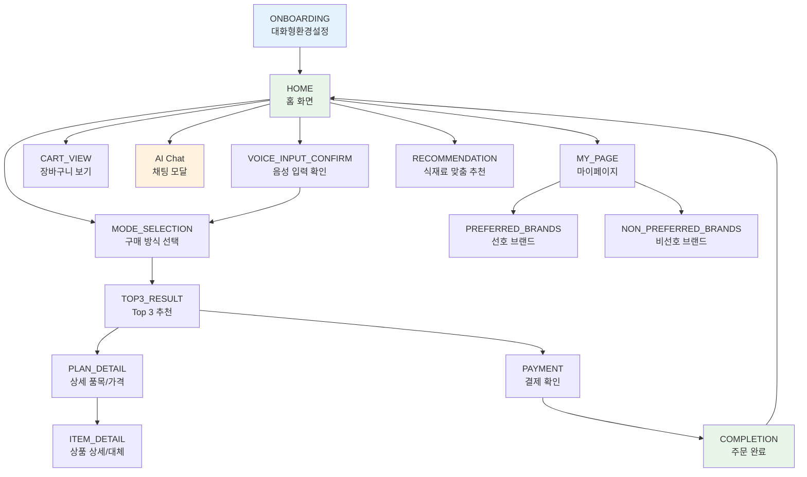

# 똑장 프론트엔드 UX 페이지 디자인 — 기능별 레퍼런스 코드 맵

> 레퍼런스 소스: `reference/frontend/ttokjang_updated/`
> 기술 스택: **Vite + React 18 + TypeScript + Tailwind CSS + Radix(shadcn) + motion(Framer Motion)**

---

## 목차

1. [전역 상태 & 화면 전환](#1-전역-상태--화면-전환)
2. [레이아웃 / 하단 네비게이션](#2-레이아웃--하단-네비게이션)
3. [대화형 환경설정 (온보딩)](#3-대화형-환경설정-온보딩)
4. [홈 화면](#4-홈-화면)
5. [음성 입력 확인 및 수정](#5-음성-입력-확인-및-수정)
6. [구매 방식 선택](#6-구매-방식-선택)
7. [Top 3 추천 플랜](#7-top-3-추천-플랜)
8. [상세 품목 및 가격 확인](#8-상세-품목-및-가격-확인)
9. [상품별 상세 정보 및 대체 추천](#9-상품별-상세-정보-및-대체-추천)
10. [식재료 맞춤 추천](#10-식재료-맞춤-추천)
11. [온라인 주문 / 결제 확인](#11-온라인-주문--결제-확인)
12. [주문 및 결제 완료](#12-주문-및-결제-완료)
13. [AI 채팅 모달](#13-ai-채팅-모달)
14. [장바구니 보기](#14-장바구니-보기)
15. [마이페이지](#15-마이페이지)
16. [선호 / 비선호 브랜드 관리](#16-선호--비선호-브랜드-관리)
17. [공용 UI 컴포넌트 (shadcn)](#17-공용-ui-컴포넌트-shadcn)

---

## 1. 전역 상태 & 화면 전환

| 항목 | 파일 경로 |
|---|---|
| 전역 상태 (Context) | [AppContext.tsx](file:///Users/lsmman/Desktop/project/똑장ver2/reference/frontend/ttokjang_updated/src/app/store/AppContext.tsx) |

### 핵심 기능
- `currentScreen` 기반의 SPA 화면 전환 (라우터 없이 Context로 관리)
- 장바구니 CRUD (`cartItems`, `removeCartItem`, `clearCart`, `updateCartItemQuantity`)
- 채팅 모달 열기/닫기 (`isChatOpen`)
- 구매 모드 선택 (`selectedMode: 'ONLINE' | 'OFFLINE'`)
- 홈 → 챗 메시지 전달 (`pendingChatMessage`)

### 화면 목록 (Screen 타입)

```typescript
type Screen =
  | 'ONBOARDING'     // 대화형 환경설정
  | 'HOME'           // 홈
  | 'VOICE_INPUT_CONFIRM' // 음성 입력 확인
  | 'MODE_SELECTION' // 구매 방식 선택
  | 'LOADING'
  | 'TOP3_RESULT'    // Top 3 추천 플랜
  | 'PLAN_DETAIL'    // 상세 품목/가격
  | 'ITEM_DETAIL'    // 상품별 상세정보
  | 'PAYMENT'        // 온라인 주문/결제
  | 'COMPLETION'     // 주문 완료
  | 'RECOMMENDATION' // 식재료 맞춤 추천
  | 'MY_PAGE'
  | 'PREFERRED_BRANDS'
  | 'NON_PREFERRED_BRANDS'
  | 'CART_VIEW';
```

### 장바구니 아이템 인터페이스

```typescript
export interface CartItem {
  id: string;
  name: string;
  price: string;       // "100g당 2,580원" 또는 "2,980원"
  quantity: number;
  unit: string;        // "g" 또는 "개"
  bgColor: string;     // 카드 배경색 e.g. '#FEF2F2'
}
```

---

## 2. 레이아웃 / 하단 네비게이션

| 항목 | 파일 경로 |
|---|---|
| 레이아웃 + 라우팅 | [App.tsx](file:///Users/lsmman/Desktop/project/똑장ver2/reference/frontend/ttokjang_updated/src/app/App.tsx) |

### 핵심 코드

```tsx
// 화면 전환 — AnimatePresence로 슬라이드 애니메이션
<AnimatePresence mode="wait">
  <motion.div
    key={currentScreen}
    initial={{ opacity: 0, x: 20 }}
    animate={{ opacity: 1, x: 0 }}
    exit={{ opacity: 0, x: -20 }}
    transition={{ duration: 0.2 }}
  >
    {currentScreen === 'ONBOARDING' && <OnboardingScreen />}
    {currentScreen === 'HOME' && <HomeScreen />}
    {/* ... 기타 화면 */}
  </motion.div>
</AnimatePresence>
```

```tsx
// 하단 네비게이션 — HOME, MY_PAGE에서만 표시
const showBottomNav = ['HOME', 'MY_PAGE'].includes(currentScreen) || isChatOpen;

// 네비 항목: 홈 / AI 챗 / 마이
<NavIcon icon={<HomeIcon />} label="홈" active={currentScreen === 'HOME'} />
<NavIcon icon={<MessageCircle />} label="AI 챗" active={isChatOpen} />
<NavIcon icon={<User />} label="마이" active={currentScreen === 'MY_PAGE'} />
```

```tsx
// 채팅 모달 — 풀스크린 슬라이드 인
<motion.div
  initial={{ opacity: 0, x: "100%" }}
  animate={{ opacity: 1, x: 0 }}
  exit={{ opacity: 0, x: "100%" }}
  transition={{ type: "spring", damping: 25, stiffness: 200 }}
  className="absolute inset-0 z-[60] bg-white"
>
  <ChatModal />
</motion.div>
```

---

## 3. 대화형 환경설정 (온보딩)

| 항목 | 파일 경로 |
|---|---|
| 메인 컴포넌트 | [대화형환경설정.tsx](file:///Users/lsmman/Desktop/project/똑장ver2/reference/frontend/ttokjang_updated/src/imports/대화형환경설정.tsx) |

### 핵심 기능
- **챗 UI 기반 온보딩**: `AiMessageBubble` / `UserMessageBubble` 컴포넌트로 대화 흐름 구현
- **2단계 설정**: 지역 설정 → 교통수단 선택
- **SuggestionChip 선택지**: 단계별로 다른 칩 안 제공
- **프로그레스 바**: 단계에 따라 50% → 90% → 100%
- **자동 스크롤**: `scrollToBottom()` — 새 메시지 추가 시 자동 하단 이동
- 완료 후 자동으로 HOME 화면 전환

### 핵심 코드

```tsx
// 스텝 기반 대화 로직
const [step, setStep] = useState<'LOCATION' | 'TRANSPORT' | 'DONE'>('LOCATION');

const handleSendMessage = () => {
  if (step === 'LOCATION') {
    // 지역 입력 후 → 교통수단 질문
    setTimeout(() => {
      setMessages(prev => [...prev, { sender: 'AI', text: '교통수단을 이용하시나요? 🛒' }]);
      setStep('TRANSPORT');
    }, 600);
  } else if (step === 'TRANSPORT') {
    finishOnboarding();
  }
};

// SuggestionChip으로 빠른 선택
<SuggestionChip label="도보" onClick={() => handleChipClick('도보')} />
<SuggestionChip label="대중교통" onClick={() => handleChipClick('대중교통')} />
```

```tsx
// 메시지 버블 — motion 애니메이션 적용
function AiMessageBubble({ children }) {
  return (
    <motion.div
      initial={{ opacity: 0, y: 10, x: -10 }}
      animate={{ opacity: 1, y: 0, x: 0 }}
      transition={{ duration: 0.4 }}
    >
      {/* AI 아이콘 + 버블 */}
    </motion.div>
  );
}
```

---

## 4. 홈 화면

| 항목 | 파일 경로 |
|---|---|
| 메인 컴포넌트 | [HomeScreen.tsx](file:///Users/lsmman/Desktop/project/똑장ver2/reference/frontend/ttokjang_updated/src/app/components/HomeScreen.tsx) |

### 핵심 기능
- **브랜드 캐릭터 이미지** 영역
- **음성/텍스트 검색 입력**: 텍스트 입력 → AI 챗으로 `pendingChatMessage` 전달
- **최근 장바구니 카드 2개**: 클릭 시 `VOICE_INPUT_CONFIRM` 이동
- **예약 장바구니 카드**: "이번주 장바구니 확인하기" → `CART_VIEW`
- **Floating CTA 버튼**: "가격 비교 시작하기" → `MODE_SELECTION`

### 핵심 코드

```tsx
// 검색 텍스트를 AI 챗으로 전달
const handleSendMessage = () => {
  if (searchText.trim()) {
    setPendingChatMessage(searchText);
    setIsChatOpen(true);
  }
};

// Floating CTA
<button
  className="bg-blue-600 text-white font-bold py-4 px-8 rounded-full shadow-xl"
  onClick={() => setCurrentScreen('MODE_SELECTION')}
>
  가격 비교 시작하기 <ChevronRight />
</button>
```

---

## 5. 음성 입력 확인 및 수정

| 항목 | 파일 경로 |
|---|---|
| 메인 컴포넌트 | [음성입력확인및수정.tsx](file:///Users/lsmman/Desktop/project/똑장ver2/reference/frontend/ttokjang_updated/src/imports/음성입력확인및수정.tsx) |

### 핵심 기능
- **음성 인식 결과 표시**: 인식된 장바구니 아이템 목록
- **수량 조절**: +/- 버튼 (g 단위: 100g 증감, 개수 단위: 1 증감)
- **아이템 수정/삭제**: 텍스트 직접 수정, 전체 삭제 확인
- **다시 말하기** 옵션
- **추가 입력** 옵션
- Figma 기반 SVG 아이콘 사용 (`svg-rz12wtz7om.ts`)

### 주요 컴포넌트
- `Button1` — 수정 (handleEdit)
- `Button2` — 다시 말하기 (handleRespeak)
- `Button3` — 추가 입력 (handleAdditionalInput)
- `Button4` — 전체 삭제 (handleClearAll + confirmClear)
- `Button6/7` — 수량 감소/증가 (handleDecrease / handleIncrease)

---

## 6. 구매 방식 선택

| 항목 | 파일 경로 |
|---|---|
| 메인 컴포넌트 | [구매방식선택.tsx](file:///Users/lsmman/Desktop/project/똑장ver2/reference/frontend/ttokjang_updated/src/imports/구매방식선택.tsx) |

### 핵심 기능
- **온라인 주문** (파란 테마): 배송 받기 → `setSelectedMode('ONLINE')` → `TOP3_RESULT`
- **오프라인 방문** (초록 테마): 매장 구매 → `setSelectedMode('OFFLINE')` → `TOP3_RESULT`
- 각 옵션에 배지, 설명, 부가 정보 포함
- 뒤로가기 → `VOICE_INPUT_CONFIRM`

### 핵심 코드

```tsx
// 온라인 선택 카드
function ButtonOption1OnlineBlueTheme() {
  const { setCurrentScreen, setSelectedMode } = useApp();
  return (
    <div
      className="bg-white rounded-[24px] cursor-pointer hover:bg-blue-50 active:scale-95"
      onClick={() => {
        setSelectedMode('ONLINE');
        setCurrentScreen('TOP3_RESULT');
      }}
    >
      {/* 🚀 가장 편리해요 배지 + "온라인 주문" + "집 앞으로 배송 받기" */}
    </div>
  );
}

// 오프라인 선택 카드
function ButtonOption2OfflineGreenTheme() {
  const { setCurrentScreen, setSelectedMode } = useApp();
  return (
    <div
      className="bg-white rounded-[24px] cursor-pointer hover:bg-green-50 active:scale-95"
      onClick={() => {
        setSelectedMode('OFFLINE');
        setCurrentScreen('TOP3_RESULT');
      }}
    >
      {/* 🛒 배송비 0원 배지 + "오프라인 방문" + "매장에서 직접 구매하기" */}
    </div>
  );
}
```

---

## 7. Top 3 추천 플랜

| 항목 | 파일 경로 |
|---|---|
| 메인 컴포넌트 | [Top3ResultScreen.tsx](file:///Users/lsmman/Desktop/project/똑장ver2/reference/frontend/ttokjang_updated/src/app/components/Top3ResultScreen.tsx) |

### 핵심 기능
- **3개 마트/플랜 카드**: 가격, 매칭률, 배지 표시
- **동적 색상**: 순위별 테마색 (green → blue → amber)
- **Progress Bar**: 매칭률 시각화
- **Trust Indicator**: "실시간 재고 확인됨 • 5분 전 업데이트"
- 카드 클릭 → `PAYMENT` 화면
- sticky 하단 바 → "1위 플랜으로 결정하기"

### 핵심 코드

```tsx
// Mock 데이터 구조
const mockTop3Plans = [
  {
    rank: 1, badge: "최저가", badgeColor: "#59A22F",
    martName: "똑장 알뜰 플랜",
    description: "배달비 포함 • 30분 내 도착",
    totalPrice: "42,500원",
    matchingRate: "9/10 품목", matchingPercent: 90,
  },
  // rank 2, 3 ...
];

// 매칭률 Progress Bar
<div className="w-16 h-2 bg-gray-200 rounded-full overflow-hidden">
  <div
    className="h-full rounded-full transition-all duration-500"
    style={{ width: `${plan.matchingPercent}%`, backgroundColor: plan.badgeColor }}
  />
</div>
```

---

## 8. 상세 품목 및 가격 확인

| 항목 | 파일 경로 |
|---|---|
| 메인 컴포넌트 | [상세품목및가격확인.tsx](file:///Users/lsmman/Desktop/project/똑장ver2/reference/frontend/ttokjang_updated/src/imports/상세품목및가격확인.tsx) |

### 핵심 기능
- **품목별 가격 비교 리스트**: 배경 카드, 가격, 가게 정보
- **TrustIndicatorBanner**: 신뢰도 표시 배너
- **PlanSummaryCard**: 플랜 요약 카드
- **BottomStickyActionBar**: 하단 고정 액션 바
- **HorizontalBorder / BackgroundBorder**: 섹션 구분 UI
- 1337줄의 대규모 Figma import 기반 컴포넌트

---

## 9. 상품별 상세 정보 및 대체 추천

| 항목 | 파일 경로 |
|---|---|
| 메인 컴포넌트 | [상품별상세정보및대체추천.tsx](file:///Users/lsmman/Desktop/project/똑장ver2/reference/frontend/ttokjang_updated/src/imports/상품별상세정보및대체추천.tsx) |

### 핵심 기능
- **상품 상세 정보**: 이름, 가격, 수량
- **대체 상품 추천**: `Item1AlternativeRecommendationHeroComponent`
- **ComparisonReason**: 대체 추천 이유 설명
- **Badge**: 추천 뱃지 (할인율, 인기 등)
- **BottomActionBar**: 하단 액션 (장바구니 추가 등)
- **SummaryCard / SectionHeader**: 정보 그룹핑

---

## 10. 식재료 맞춤 추천

| 항목 | 파일 경로 |
|---|---|
| 메인 컴포넌트 | [식재료맞춤추천.tsx](file:///Users/lsmman/Desktop/project/똑장ver2/reference/frontend/ttokjang_updated/src/imports/식재료맞춤추천.tsx) |

### 핵심 기능
- **FAB (Floating Action Button)**: `FloatingActionButtonFab`
- **카테고리별 식재료 링크**: `Link` ~ `Link4` 컴포넌트
- **BottomNavigationBar**: 하단 네비게이션
- **TrustBlockPersonalizationInfo**: 개인화 추천 근거 블록
- **SuccessConfirmation**: 추천 수락 확인
- **이미지 에셋**: figma:asset 기반 상품 이미지 3개

---

## 11. 온라인 주문 / 결제 확인

| 항목 | 파일 경로 |
|---|---|
| 메인 컴포넌트 | [온라인주문결제확인.tsx](file:///Users/lsmman/Desktop/project/똑장ver2/reference/frontend/ttokjang_updated/src/imports/온라인주문결제확인.tsx) |

### 핵심 기능
- **TrustBlockAgentUi**: AI 에이전트 신뢰도 표시
- **SectionDeliveryAddress**: 배송지 섹션
- **SectionOrderItems**: 주문 상품 목록 (이미지 포함)
- **주문 상품 카드**: `OrganicRedApples`, `FreshOrganicCarrots`, `MilkCartonBottle`
- **이미지 에셋**: `figma:asset/` 기반 상품 이미지 3개
- **결제 금액 요약**: 가격 라벨 컴포넌트

---

## 12. 주문 및 결제 완료

| 항목 | 파일 경로 |
|---|---|
| 메인 컴포넌트 | [주문및결제완료.tsx](file:///Users/lsmman/Desktop/project/똑장ver2/reference/frontend/ttokjang_updated/src/imports/주문및결제완료.tsx) |

### 핵심 기능
- **SuccessAnimationIcon**: 원형 체크 아이콘 (초록 그라데이션)
- **OrderSummaryCard**: 총 결제 금액 + 배송 정보
- **LogisticsInfo**: 배송 예정 시간 + 배송지
- **PromotionSmartTipSection**: "AI 소비 분석 팁" 카드
- **ActionButtons**: "홈으로 돌아가기" / "영수증 보기"
- 주문번호 표시

### 핵심 코드

```tsx
// 주문 완료 카드 — 배송 정보
function OrderSummaryCard() {
  return (
    <div className="bg-[#f9fafb] rounded-[12px] p-[25px]">
      <TotalAmount />    {/* 총 결제 금액: 52,000원 */}
      <LogisticsInfo />  {/* 배송 예정: 오늘 18:00 / 배송지: 서울시 강남구 */}
    </div>
  );
}

// AI 소비 분석 팁
function PromotionSmartTipSection() {
  return (
    <div className="bg-[rgba(19,236,19,0.05)] rounded-[8px]">
      <p>AI 소비 분석 팁</p>
      <p>지난달보다 채소 구매 비중이 15% 늘었어요!</p>
    </div>
  );
}
```

---

## 13. AI 채팅 모달

| 항목 | 파일 경로 |
|---|---|
| 메인 컴포넌트 | [똑장Ai채팅모달_NEW.tsx](file:///Users/lsmman/Desktop/project/똑장ver2/reference/frontend/ttokjang_updated/src/imports/똑장Ai채팅모달_NEW.tsx) |

### 핵심 기능
- **풀스크린 채팅 UI**: 헤더 + 채팅 본문 + 입력 영역
- **메시지 전달 수신**: `pendingChatMessage`로 홈에서 전달된 메시지 받기
- **Quick Reply 버튼**: "네, 추천해주세요!" / "비슷한 스타일 더 보기"
- **입력 영역**: 마이크 + 텍스트 입력 + 첨부 + 전송

### 핵심 코드

```tsx
export default function AiChatFullScreen() {
  const { setIsChatOpen, pendingChatMessage, setPendingChatMessage } = useApp();
  const [chatInput, setChatInput] = useState('');

  // 홈에서 전달된 메시지를 채팅 입력창에 반영
  useEffect(() => {
    if (pendingChatMessage) {
      setChatInput(pendingChatMessage);
      setPendingChatMessage('');
    }
  }, [pendingChatMessage]);

  const handleSend = () => {
    if (chatInput.trim()) {
      console.log('메시지 전송:', chatInput);
      setChatInput('');
    }
  };
  // ...
}
```

---

## 14. 장바구니 보기

| 항목 | 파일 경로 |
|---|---|
| 메인 컴포넌트 | [CartViewScreen.tsx](file:///Users/lsmman/Desktop/project/똑장ver2/reference/frontend/ttokjang_updated/src/app/components/CartViewScreen.tsx) |

### 핵심 기능
- **장바구니 아이템 리스트**: 이름, 가격, 수량, 색상 카드
- **편집 모드**: 수량 조절 (+/- 버튼), 삭제 버튼
- **상품 추가 모달**: 상품명, 가격, 수량, 단위(개/g) 입력
- **가격 계산 로직**: g 단위(100g 기준) / 개수 단위 구분
- **하단 주문 바**: 예상 총 금액 + "주문하기" 버튼 → `PAYMENT`

### 핵심 코드

```tsx
// 가격 계산 — g/개 단위 구분
const calculateTotal = () => {
  let total = 0;
  cartItems.forEach(item => {
    const priceMatch = item.price.match(/[\d,]+/);
    if (priceMatch) {
      const price = parseInt(priceMatch[0].replace(/,/g, ''));
      if (item.unit === 'g') {
        total += (price * item.quantity) / 100; // 100g 기준
      } else {
        total += price * item.quantity;
      }
    }
  });
  return total;
};

// 수량 조절 — g: 100 단위, 개: 1 단위
const handleQuantityChange = (id, delta, currentQuantity, unit) => {
  let newQuantity = currentQuantity + delta;
  if (unit === 'g') {
    if (newQuantity < 100) newQuantity = 100;
  } else {
    if (newQuantity < 1) newQuantity = 1;
  }
  updateCartItemQuantity(id, newQuantity);
};
```

---

## 15. 마이페이지

| 항목 | 파일 경로 |
|---|---|
| 메인 컴포넌트 | [MyPageScreen.tsx](file:///Users/lsmman/Desktop/project/똑장ver2/reference/frontend/ttokjang_updated/src/app/components/MyPageScreen.tsx) |

### 핵심 기능
- **프로필 요약**: 이름, 이메일, 회원등급
- **계정 관리**: 내 정보, 결제 수단
- **쇼핑 설정**: 선호 브랜드 → `PREFERRED_BRANDS` / 비선호 브랜드 → `NON_PREFERRED_BRANDS`
- **앱 설정**: 알림, 환경설정, 고객센터
- **로그아웃**: → `ONBOARDING`

### 핵심 코드

```tsx
// 재사용 가능한 메뉴 아이템 패턴
function MenuItem({ icon: Icon, label, onClick, subLabel }) {
  return (
    <div onClick={onClick} className="flex items-center justify-between p-4 bg-white hover:bg-gray-50 cursor-pointer">
      <div className="flex items-center gap-3">
        <div className="p-2 bg-gray-100 rounded-full"><Icon size={20} /></div>
        <span className="text-gray-900 font-medium">{label}</span>
      </div>
      {subLabel && <span className="text-gray-400 text-sm">{subLabel}</span>}
    </div>
  );
}
```

---

## 16. 선호 / 비선호 브랜드 관리

| 항목 | 파일 경로 |
|---|---|
| 선호 브랜드 | [PreferredBrandsScreen.tsx](file:///Users/lsmman/Desktop/project/똑장ver2/reference/frontend/ttokjang_updated/src/app/components/PreferredBrandsScreen.tsx) |
| 비선호 브랜드 | [NonPreferredBrandsScreen.tsx](file:///Users/lsmman/Desktop/project/똑장ver2/reference/frontend/ttokjang_updated/src/app/components/NonPreferredBrandsScreen.tsx) |

### 핵심 기능
- **브랜드 목록 CRUD**: 추가, 삭제
- **추가 모달**: 이름 입력 → Enter 또는 버튼 클릭
- **빈 상태 처리**: 브랜드 없을 때 안내 메시지

### 핵심 코드

```tsx
// 브랜드 추가 로직
const addBrand = () => {
  if (newBrandName.trim()) {
    setBrands(prev => [...prev, {
      id: Date.now().toString(),
      name: newBrandName,
      category: '기타'
    }]);
    setNewBrandName('');
    setShowAddModal(false);
  }
};

// 브랜드 삭제
const removeBrand = (id: string) => {
  setBrands(prev => prev.filter(b => b.id !== id));
};
```

---

## 17. 공용 UI 컴포넌트 (shadcn)

| 항목 | 파일 경로 |
|---|---|
| UI 디렉토리 | `src/app/components/ui/*` |

**Radix UI 기반 shadcn 스타일 컴포넌트** 48개:

| 카테고리 | 컴포넌트 |
|---|---|
| **입력** | `button`, `input`, `textarea`, `checkbox`, `radio-group`, `select`, `slider`, `switch`, `toggle`, `toggle-group`, `input-otp` |
| **레이아웃** | `card`, `separator`, `aspect-ratio`, `resizable`, `scroll-area`, `sidebar`, `tabs` |
| **피드백** | `alert`, `alert-dialog`, `badge`, `progress`, `skeleton`, `sonner`, `tooltip` |
| **오버레이** | `dialog`, `drawer`, `dropdown-menu`, `sheet`, `popover`, `hover-card`, `command`, `context-menu` |
| **네비게이션** | `breadcrumb`, `menubar`, `navigation-menu`, `pagination` |
| **데이터** | `accordion`, `calendar`, `carousel`, `chart`, `collapsible`, `form`, `table` |
| **기타** | `avatar`, `label`, `use-mobile` (hook), `utils` |

---

## 사용자 흐름 요약


